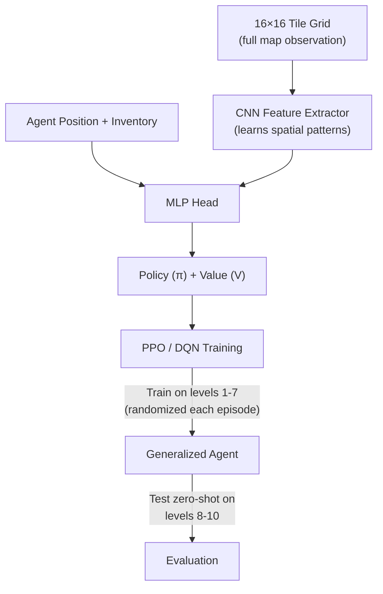

# Bobby Carrot RL — Complete Codebase Analysis

## Project Overview

Bobby Carrot is a **grid-based puzzle-collection game** ported from Rust to Python using `pygame`. A rabbit ("Bobby") moves on a 16×16 tile grid, collecting carrots (or eggs on egg-levels), navigating hazards (traps, crumble tiles, conveyors, locked doors), and reaching a finish tile after all collectibles are gathered.

Your goal: **Train an RL agent on levels 1–7, then test generalization on levels 8–10.**

---

## File-by-File Breakdown

### Project Root

| File | Purpose |
|------|---------|
| [README.md](file:///c:/Users/avvar/Desktop/Bobby_Carrot_Game_Using_RL/README.md) | Project docs: setup, running instructions |
| [requirements.txt](file:///c:/Users/avvar/Desktop/Bobby_Carrot_Game_Using_RL/requirements.txt) | Dependencies: `numpy`, `pygame`, `torch` |
| [LEVEL_3_COMMANDS.md](file:///c:/Users/avvar/Desktop/Bobby_Carrot_Game_Using_RL/LEVEL_3_COMMANDS.md) | CLI examples for training/playing level 3 |
| [pyrefly.toml](file:///c:/Users/avvar/Desktop/Bobby_Carrot_Game_Using_RL/pyrefly.toml) | Type-checker config |

---

### `Game_Python/` — The Game Engine

#### [game.py](file:///c:/Users/avvar/Desktop/Bobby_Carrot_Game_Using_RL/Game_Python/bobby_carrot/game.py) (798 lines) — **Core Game Logic**

This is the **heart of the game**. It contains:

##### Constants
- Grid: **16×16 tiles**, each 32×32 pixels
- Viewport: **10×12 tiles** (scrolling camera follows Bobby)
- 60 FPS, 2 frames per animation step

##### `Map` class (line 60)
- Wraps a level identifier: `kind` ("normal" or "egg") + `number` (1–30 normal, 1–20 egg)
- `load_map_info()` → reads the `.blm` binary file (256 bytes of tile data after 4-byte header), counts carrots, eggs, finds start position
- `next()` / `previous()` → cycle through levels

##### `MapInfo` class (line 113)
- Holds: `data` (256-int list = 16×16 grid), `coord_start`, `carrot_total`, `egg_total`

##### Tile ID Dictionary — **Critical for Understanding Mechanics**

| Tile ID | Meaning |
|---------|---------|
| 0–17 | **Walls / impassable** (forbid=True if `new_item < 18`) |
| 18 | Empty walkable floor |
| 19 | 🥕 **Carrot** (uncollected) → becomes 20 when collected |
| 20 | Collected carrot (empty floor) |
| 21 | **Start position** (Bobby spawns here) |
| 22–23 | **Red switch** (toggle pair; pressing 22 flips all 22↔23, 24→25→26→27→24, 28↔29) |
| 24–27 | **Rotating arrow tiles** (restrict movement direction, rotate on exit) |
| 28–29 | **Bi-directional conveyors** (restrict to horizontal/vertical only, toggle on exit) |
| 30 | **Crumble tile** → becomes 31 (trap) after Bobby walks off |
| 31 | **Trap / death tile** → Bobby dies if he steps here |
| 32 | **Gray key** (pickup) |
| 33 | **Gray lock** (requires gray key) |
| 34 | **Yellow key** (pickup) |
| 35 | **Yellow lock** (requires yellow key) |
| 36 | **Red key** (pickup) |
| 37 | **Red lock** (requires red key) |
| 38–39 | **Green switch** (toggle pair; flips 38↔39, 40↔41, 42↔43) |
| 40–43 | **Conveyor belts** (force Bobby's next direction: Left/Right/Up/Down) |
| 44 | **Finish tile** (activates only after all carrots/eggs collected) |
| 45 | **Egg** (collectible on egg levels) → becomes 46 after collected |
| 46 | Collected egg (now a trap — treated same as death!) |

##### `Bobby` class (line 135)
- Player state: position (`coord_src`/`coord_dest`), movement state, inventory (carrot/egg count, keys)
- `update_dest()` — **collision detection**: checks if next tile is walkable given current direction. Handles arrow/conveyor restrictions (can only enter from certain directions), key/lock gates
- `update_texture_position()` — advances animation frames, triggers tile interactions at frame 8 (mid-movement): collects items, toggles switches, crumble conversion, conveyor forcing

##### `main()` (line 520)
- Pygame main loop: handles keyboard input (WASD/arrows), draws tiles + Bobby sprite + HUD (carrot count, time, keys), manages death/win transitions

#### [rl_env.py](file:///c:/Users/avvar/Desktop/Bobby_Carrot_Game_Using_RL/Game_Python/bobby_carrot/rl_env.py) (713 lines) — **RL Environment Wrapper**

A **Gym-style environment** wrapping the game engine for RL training.

##### Actions
```
0 = LEFT, 1 = RIGHT, 2 = UP, 3 = DOWN  (4 actions, no NOOP)
```

##### `RewardConfig` — Dense Reward Shaping
| Signal | Default Value | Purpose |
|--------|---------------|---------|
| `carrot` | +15.0 | Collecting a carrot |
| `egg` | +25.0 | Collecting an egg |
| `finish` | +100.0 | Reaching finish tile after all collected |
| `death` | −100.0 | Dying (trap tile) |
| `step` | −0.05 | Per-step cost to encourage speed |
| `invalid_move` | −1.0 | Trying to walk into a wall |
| `distance_delta_scale` | 0.5 | Reward/penalty proportional to L1 distance change to nearest target |
| `repeat_position_penalty` | −0.25 | Revisiting recent position |
| `immediate_backtrack_penalty` | −0.3 | Going back to previous position |
| `no_progress_penalty_after` | 40 steps | Starts penalizing stagnation |

##### Observation Modes
1. **`compact`** (default) — `[px, py] + local_view` where local tiles are bucketed into 8 categories (wall=0, carrot=1, egg=2, finish=3, trap=4, key=5, lock=6, other=7)
2. **`local`** — Same structure but with raw tile IDs instead of buckets
3. **`full`** — `[px, py] + all 256 tiles` (entire level map)

With `include_inventory=True`, 6 extra features are appended: key flags, remaining counts, all-collected flag.

##### Key Methods
- `reset()` → fresh level, returns observation
- `step(action)` → applies action, advances game frames until transition settles, returns `(obs, reward, done, info)`
- `get_valid_actions()` → returns mask of legal moves (no wall-walking, optionally no death)
- `_advance_until_transition()` → fast-forwards the game engine frames until Bobby finishes walking (8 animation frames per step)
- `_phase_distance()` → Manhattan distance to nearest uncollected target, or to finish if all collected

##### Observation Size (compact, 3×3 view, with inventory)
```
2 (position) + 9 (3×3 local tiles) + 6 (inventory) = 17 integers
```

#### Other `Game_Python/` Files
| File | Purpose |
|------|---------|
| [__init__.py](file:///c:/Users/avvar/Desktop/Bobby_Carrot_Game_Using_RL/Game_Python/bobby_carrot/__init__.py) | Exports `main` and `BobbyCarrotEnv` |
| [__main__.py](file:///c:/Users/avvar/Desktop/Bobby_Carrot_Game_Using_RL/Game_Python/bobby_carrot/__main__.py) | `python -m bobby_carrot` entry point |
| [run.py](file:///c:/Users/avvar/Desktop/Bobby_Carrot_Game_Using_RL/Game_Python/run.py) | Rust launcher (not relevant for RL) |
| [pyproject.toml](file:///c:/Users/avvar/Desktop/Bobby_Carrot_Game_Using_RL/Game_Python/pyproject.toml) | Package config |

#### Assets
- **50 level files** (`.blm`): 30 normal + 20 egg levels, 260 bytes each (4 header + 256 tile grid)
- **26 image files**: Bobby sprites (idle, death, fade, directional), tileset, conveyors, HUD, etc.
- **16 audio files**: MIDI music and sound effects

---

### `Bobby_Carrot/` — The Training Code

#### [train_q_learning.py](file:///c:/Users/avvar/Desktop/Bobby_Carrot_Game_Using_RL/Bobby_Carrot/train_q_learning.py) (746 lines) — **Q-Learning Trainer**

##### `QLearningConfig`
Key parameters:
- 10,000 episodes, α=0.15, γ=0.99
- ε-greedy: starts at 1.0, decays by 0.998 per episode, min 0.05
- **Curriculum learning**: starts at level 3, promotes to next level after 80% success over 60-episode window
- Max 800 steps per episode

##### Training Loop
1. For each episode: pick level (via curriculum or fixed), reset env
2. Each step: get valid action mask, ε-greedy action selection with progress-score tiebreaking
3. Standard Q-learning update: `Q(s,a) += α * (r + γ * max Q(s',a') - Q(s,a))`
4. Periodically runs greedy evaluation and saves best checkpoint

##### State Representation = **Q-table key**
The Q-table uses `observation_to_key(obs)` which converts the 17-integer observation into a **tuple of ints** used as a dictionary key.

##### Support Functions
- `play_trained_agent()` → loads Q-table, runs greedy policy with optional rendering
- `evaluate_q_table()` → runs N episodes to compute success rate, mean reward, etc.
- `_preview_policy()` → inline visualization during training
- Full CLI with argparse for all hyperparameters

##### Saved Models
- `q_table_level3_v8.pkl` (86KB) — trained Q-table for level 3
- `q_table_level3_v8_best.pkl` (86KB) — best performing checkpoint

---

## Critical Assessment: Why Q-Learning Won't Work for Your Goal

> [!CAUTION]
> **Q-learning with a tabular Q-table fundamentally cannot generalize across levels.** Here's why:

### Problem 1: State Space Explosion
The Q-table maps *exact observation tuples* to Q-values. Each level has a **completely different map layout**, so:
- States seen on level 1 will **never appear** on level 5
- A Q-table trained on levels 1–7 is just 7 separate, non-overlapping lookup tables glued together
- There is **zero transfer** — the agent literally has never seen any state from level 8

### Problem 2: No Feature Learning
With `compact` mode (3×3 local view + position + inventory), the observation includes `(px, py)` — the **absolute position**. Position (3,5) on level 1 is a completely different situation than (3,5) on level 7, but Q-learning treats them as identical if the local tiles happen to match.

### Problem 3: Crumble Tiles Are Combinatorial
Levels 4+ have crumble tiles (tile 30 → 31). The order you walk on them **permanently changes the map**. A 3×3 local view can't see the downstream consequences, and Q-learning can't reason about path planning.

### Current Status
From your conversation history, Q-learning has been struggling with levels 4–5 for weeks. The approach was iteratively patched (BFS reachability, reward shaping, crumble-aware penalties), but these are bandaids on a fundamental architectural limitation.

---

## What You Need Instead

> [!IMPORTANT]
> To train on levels 1–7 and **test on levels 8–10**, you need a **neural network-based RL agent** that learns generalizable features rather than memorizing exact states.

### Recommended Architecture



### Key Design Decisions

| Decision | Recommendation | Why |
|----------|---------------|-----|
| **Algorithm** | **PPO** (Proximal Policy Optimization) | Stable, handles partial observability well, works with discrete actions |
| **Observation** | **Full 16×16 map** (mode=`full`) | CNN can learn spatial patterns that transfer across levels |
| **Network** | CNN (3 conv layers) → MLP (2 FC layers) | Extract local features (walls, carrots, traps) that are level-independent |
| **Training** | Random level selection from 1–7 each episode | Forces generalization instead of memorization |
| **State encoding** | **Relative features** (no absolute position baked in) or position encoding | Prevents overfitting to absolute coordinates |

### What Your Existing Codebase Already Provides
✅ The RL environment (`BobbyCarrotEnv`) is **well-designed** and ready to use  
✅ The `full` observation mode gives the complete 16×16 map  
✅ The reward shaping is solid and comprehensive  
✅ Valid action masking prevents wasted exploration  
✅ Headless mode for fast training  

### What Needs to Be Built
- [ ] DQN or PPO agent with a CNN-based neural network (PyTorch)
- [ ] Multi-level training loop (randomly sample level 1–7 each episode)
- [ ] Proper evaluation pipeline on levels 8–10
- [ ] TensorBoard/logging for tracking progress across levels
- [ ] Checkpoint saving with per-level performance tracking

---

## Open Questions Before Implementation

> [!IMPORTANT]
> Before I start building the training system, I need your input on these:

1. **Algorithm choice**: Do you prefer **PPO** (more stable, better for this type of problem) or **DQN** (simpler to understand, you've used it before)?

2. **Compute**: Are you training on **CPU only** or do you have a **GPU** (CUDA)? This affects batch sizes and expected training time.

3. **Previous work**: Your conversation history mentions PPO, Rainbow DQN, and ICM implementations from earlier conversations. Do you have any of that code saved, or should we start fresh?

4. **Level scope**: You said levels 1–7 for training, 8–10 for testing. Are these all "normal" levels, or do you also want egg levels?

5. **Success criteria**: What performance do you consider "good enough" on the test levels (8–10)? E.g., >50% completion rate, >80%, etc.?
