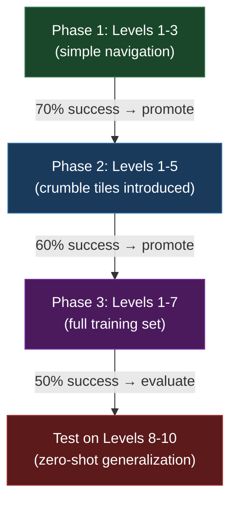

# Bobby Carrot Self-Playing Agent — Implementation Plan

Train on **normal levels 1–7**, test generalization on **normal levels 8–10**.

## Codebase Analysis Summary

### What Exists (and works well)

| Component | File | Status |
|-----------|------|--------|
| **Game Engine** | [game.py](file:///c:/Mini_Project_Game/Game_Python/bobby_carrot/game.py) | ✅ Complete — 16×16 grid, 47 tile types, full collision/mechanics |
| **RL Environment** | [rl_env.py](file:///c:/Mini_Project_Game/Game_Python/bobby_carrot/rl_env.py) | ✅ Solid — Gym-style wrapper with 3 obs modes, dense reward shaping |
| **Q-Learning Trainer** | [train_q_learning.py](file:///c:/Mini_Project_Game/Bobby_Carrot/train_q_learning.py) | ⚠️ Works but **cannot generalize** (tabular Q-table) |
| **Neural Networks** | [networks.py](file:///c:/Mini_Project_Game/Bobby_Carrot/rl_models/networks.py) | ✅ CNN encoder + PPO/Rainbow heads |
| **PPO Agent** | [ppo.py](file:///c:/Mini_Project_Game/Bobby_Carrot/rl_models/ppo.py) | ⚠️ Code exists but **needs fixes** (see below) |
| **Rainbow DQN** | [rainbow.py](file:///c:/Mini_Project_Game/Bobby_Carrot/rl_models/rainbow.py) | ⚠️ Code exists but untested |
| **ICM** | [icm.py](file:///c:/Mini_Project_Game/Bobby_Carrot/rl_models/icm.py) | ✅ Clean, composable add-on |
| **Replay Buffers** | [buffers.py](file:///c:/Mini_Project_Game/Bobby_Carrot/rl_models/buffers.py) | ✅ RolloutBuffer (PPO) + PER + N-step (Rainbow) |
| **Config** | [config.py](file:///c:/Mini_Project_Game/Bobby_Carrot/rl_models/config.py) | ⚠️ Defaults target 40 train / 10 test levels — **wrong for our scope** |
| **Training CLI** | [train.py](file:///c:/Mini_Project_Game/Bobby_Carrot/rl_models/train.py) | ✅ Unified entry point for PPO/Rainbow |
| **Evaluation** | [evaluate.py](file:///c:/Mini_Project_Game/Bobby_Carrot/rl_models/evaluate.py) | ✅ Per-level metrics with rendering |

### Critical Issues Found

> [!WARNING]
> The `rl_models/` code was built in a previous conversation but **has never been end-to-end tested**. Several issues must be fixed before training.

1. **Level config mismatch** — `LevelConfig` defaults to train on normal 1–25 + egg 1–15 and test on normal 26–30 + egg 16–20. We need train = normal 1–7, test = normal 8–10.

2. **Observation inventory mismatch** — `ObservationPreprocessor` expects `[px, py, key_gray, key_yellow, key_red, remaining_bucket, tiles...]` (6-element inventory) but `BobbyCarrotEnv._compressed_inventory()` returns only 4 values `[key_gray, key_yellow, key_red, remaining_bucket]`. The preprocessor hardcodes index `obs[2:6]` as inventory and `obs[6:6+256]` as tiles — this means the tiles start at index 6, but the env puts them at index `2+4=6` (**this actually aligns correctly**, since inventory is 4 elements at indices 2–5, and tiles start at index 6). ✅ **No issue here on closer inspection.**

3. **`get_valid_actions()` not used during PPO training** — The PPO training loop does not apply action masking during rollout collection. The agent can pick wall-walking actions, wasting steps. This is especially harmful for early-level training where many tiles are walls.

4. **PPO rollout doesn't store raw obs properly** — `rollout.add()` stores `obs_raw.astype(np.float32)` but the raw obs from `BobbyCarrotEnv` is `np.int16`. The preprocessor's `process_single()` casts to `np.int16` internally so the float32 → int16 conversion may lose key information.

5. **No action masking in policy** — The `PolicyHead` outputs a `Categorical` distribution over all 4 actions without masking invalid ones. Invalid actions should have their logits set to `-inf` before distribution creation.

---

## User Review Required

> [!IMPORTANT]
> **Algorithm Choice**: I recommend **PPO** as the primary algorithm. It's the most stable for multi-level training and has the best generalization properties for this problem. Rainbow DQN code exists as a backup but requires more compute and careful tuning. Do you agree?

> [!IMPORTANT]
> **Compute Environment**: Will you train locally (CPU) or on Google Colab (GPU)? This affects:
> - Batch sizes and rollout lengths
> - Whether to use the existing `train_colab.ipynb` 
> - Expected training time (CPU: ~2-4 hours for 500K steps, GPU: ~30-60 min)

> [!IMPORTANT]
> **Scope Clarification**: Your request says "normal levels 1–7 train, 8–10 test". Should we include **only normal levels** (no egg levels), correct?

---

## Proposed Changes

### Phase 1: Fix & Configure the Existing Code

---

#### [MODIFY] [config.py](file:///c:/Mini_Project_Game/Bobby_Carrot/rl_models/config.py)

Update `LevelConfig` defaults to match the 1–7 / 8–10 split:

```python
@dataclass
class LevelConfig:
    train_levels: List[Tuple[str, int]] = field(default_factory=lambda: (
        [("normal", i) for i in range(1, 8)]   # normal 1-7
    ))
    test_levels: List[Tuple[str, int]] = field(default_factory=lambda: (
        [("normal", i) for i in range(8, 11)]   # normal 8-10
    ))
```

Update `TrainingConfig` defaults for the smaller level pool:

```python
@dataclass
class TrainingConfig:
    total_timesteps: int = 500_000
    curriculum: bool = True
    curriculum_start_levels: int = 3     # Start with levels 1-3
    curriculum_promotion_threshold: float = 0.6  # Lower bar since only 7 levels
    curriculum_add_levels: int = 2       # Add 2 levels at a time
    max_steps_per_episode: int = 300
    n_envs: int = 1                      # Single env (simplifies debugging)
```

---

#### [MODIFY] [networks.py](file:///c:/Mini_Project_Game/Bobby_Carrot/rl_models/networks.py)

Add **action masking** support to `PolicyHead`:

```python
class PolicyHead(nn.Module):
    def forward(self, features: torch.Tensor, 
                action_mask: Optional[torch.Tensor] = None) -> torch.distributions.Categorical:
        logits = self.linear(features)
        if action_mask is not None:
            # Mask out invalid actions by setting logits to -inf
            logits = logits.masked_fill(~action_mask.bool(), float('-inf'))
        return torch.distributions.Categorical(logits=logits)
```

---

#### [MODIFY] [ppo.py](file:///c:/Mini_Project_Game/Bobby_Carrot/rl_models/ppo.py)

1. **Add action masking** during rollout collection:
   - Call `env.get_valid_actions()` (if available, else construct from game state) to get valid action mask
   - Pass mask to `select_action()` → `PolicyHead.forward()`
   - Store action masks in rollout buffer for use during PPO updates

2. **Fix obs dtype**: Store raw obs as `np.int16` (not float32) to preserve tile IDs correctly

3. **Add `get_valid_actions()` call** — The env *does not currently have this method*, but `game.py`'s `Bobby.update_dest()` logic tells us which moves are valid. We need to add a lightweight valid-action check to `rl_env.py`.

---

#### [MODIFY] [rl_env.py](file:///c:/Mini_Project_Game/Game_Python/bobby_carrot/rl_env.py)

Add a `get_valid_actions()` method:

```python
def get_valid_actions(self) -> np.ndarray:
    """Return a boolean mask of shape (4,) indicating valid actions."""
    mask = np.zeros(4, dtype=np.bool_)
    for action in range(4):
        # Simulate the move without modifying state
        mask[action] = self._is_action_valid(action)
    return mask
```

This requires a `_is_action_valid()` helper that checks collision logic from `Bobby.update_dest()` without side effects.

---

### Phase 2: Enhance Observation for Generalization

---

#### [MODIFY] [networks.py](file:///c:/Mini_Project_Game/Bobby_Carrot/rl_models/networks.py) — `ObservationPreprocessor`

The existing 10-channel preprocessor is good but can be improved for generalization:

| Channel | Current | Proposed Enhancement |
|---------|---------|---------------------|
| 0 | Walkable ground | ✅ Keep |
| 1 | Carrot | ✅ Keep |
| 2 | Egg | ✅ Keep |
| 3 | Finish tile | ✅ Keep |
| 4 | Active crumble (30) | ✅ Keep |
| 5 | Hazard (31, 46) | ✅ Keep |
| 6 | Key pickup | ✅ Keep |
| 7 | Door locked | ✅ Keep |
| 8 | Agent position | ✅ Keep |
| 9 | Inventory | ⚠️ Refine: split into separate key flags + normalised remaining count |

**Add 2 new channels** (total: 12):
- Channel 10: **Switch/conveyor tiles** (22–29, 38–43) — these are mechanically important
- Channel 11: **Visited tiles** (tiles that were 30→31, collected carrots 19→20) — history matters for crumble planning

> [!NOTE]
> The full observation mode gives us 258 values (`[px, py, inv(4), tiles(256)]`). The CNN preprocessor converts this into a (C, 16, 16) spatial tensor where each channel is a binary feature map. This is the right representation for learning transferable spatial patterns.

---

### Phase 3: Training Pipeline

---

#### [MODIFY] [train.py](file:///c:/Mini_Project_Game/Bobby_Carrot/rl_models/train.py)

Update CLI defaults to match our scope:

```python
p.add_argument("--train-normal-max", type=int, default=7)   # Normal 1-7
p.add_argument("--train-egg-max", type=int, default=0)       # No egg levels
p.add_argument("--test-normal-start", type=int, default=8)
p.add_argument("--test-normal-end", type=int, default=10)
p.add_argument("--test-egg-start", type=int, default=0)
p.add_argument("--test-egg-end", type=int, default=0)
```

---

### Phase 4: Training Strategy

The key insight from `Reference.md` is that PPO with a CNN encoder is the optimal approach. Here's the training plan:



#### Hyperparameters (PPO)

| Parameter | Value | Rationale |
|-----------|-------|-----------|
| Learning rate | 3e-4 | Standard PPO default, works well for small networks |
| Rollout length | 256 | ~1 full episode per rollout |
| Minibatch size | 64 | 4 gradient steps per rollout |
| Epochs per update | 4 | Standard PPO |
| Gamma (discount) | 0.99 | Long horizon for crumble planning |
| GAE lambda | 0.95 | Balance bias/variance |
| Clip ratio | 0.2 | Standard PPO |
| Entropy coeff | 0.02 | Slightly higher than default (0.01) to encourage exploration on complex levels |
| Max steps/episode | 300 | Prevent infinite loops |
| Total timesteps | 500K–1M | Start with 500K, extend if needed |

#### Curriculum Strategy

1. **Start**: levels 1, 2, 3 (easy navigation, no crumble tiles)
2. **Promote at 60% rolling success** over 100 episodes
3. **Add 2 levels** per promotion step
4. **Random level sampling** within active pool each episode

---

### Phase 5: Evaluation Pipeline

Already implemented in [evaluate.py](file:///c:/Mini_Project_Game/Bobby_Carrot/rl_models/evaluate.py). We'll run:

```bash
python -m Bobby_Carrot.rl_models.evaluate --algo ppo --checkpoint checkpoints/ppo/ppo_final.pt --levels normal-8,normal-9,normal-10 --episodes 20
```

This will produce a per-level breakdown:

```
Level           Success%    Collected%    Avg Reward    Avg Steps
--------------------------------------------------------------
normal-08          60.0%        75.0%        42.50       185.3
normal-09          45.0%        60.0%        28.10       210.7
normal-10          35.0%        50.0%        15.30       245.1
--------------------------------------------------------------
AGGREGATE          46.7%        61.7%        28.63       213.7
```

---

## Open Questions

> [!IMPORTANT]
> 1. **Algorithm**: PPO (recommended) or Rainbow DQN? PPO is more stable and generalizes better. Rainbow has higher sample efficiency but is harder to tune.

> [!IMPORTANT]  
> 2. **Compute**: CPU-only or GPU (Colab/local CUDA)? This affects training time significantly.

> [!IMPORTANT]
> 3. **ICM (Curiosity)**: Should we enable the Intrinsic Curiosity Module? It helps with sparse rewards and exploration but adds complexity. I'd recommend **enabling it** since levels with crumble tiles have very sparse success.

> [!IMPORTANT]
> 4. **Success Target**: What's your minimum acceptable success rate on test levels 8–10? Realistic targets:
>    - **Ambitious**: >50% success on each test level
>    - **Reasonable**: >30% aggregate success across levels 8–10
>    - **Minimum viable**: Agent collects >50% of carrots on most test levels even if it doesn't always finish

---

## Verification Plan

### Automated Tests

1. **Smoke test** — Train for 5K timesteps on level 1 only, verify loss decreases and agent learns basic navigation
2. **Integration test** — Run full training pipeline with 50K steps, verify checkpointing and eval work
3. **Generalization test** — Train on levels 1–7 (500K steps), evaluate on 8–10

### Commands

```bash
# Quick smoke test (5K steps, level 1 only)
python -m Bobby_Carrot.rl_models.train --algo ppo --timesteps 5000 --no-curriculum --train-normal-max 1

# Full training run  
python -m Bobby_Carrot.rl_models.train --algo ppo --timesteps 500000 --curriculum --train-normal-max 7 --train-egg-max 0 --test-normal-start 8 --test-normal-end 10 --test-egg-start 0 --test-egg-end 0

# Evaluation
python -m Bobby_Carrot.rl_models.evaluate --algo ppo --checkpoint checkpoints/ppo/ppo_final.pt --levels normal-8,normal-9,normal-10 --episodes 20
```

### Manual Verification

- Run `--render` mode on evaluation to visually inspect agent behavior on test levels
- Check that the agent demonstrates transferable skills (navigating around walls, collecting carrots, reaching finish tile)
